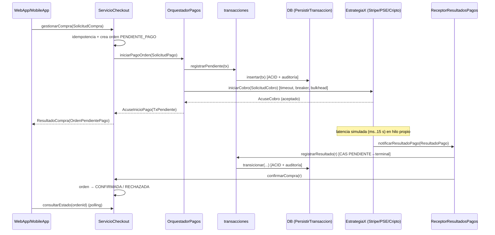

# 02 — Arquitectura: diagrama corregido (Punto 3) traducido a especificación

Fuente: `Deployment_Diagram1` (Visual Paradigm, UML 2.5). Este documento es la única descripción del diagrama que
tienes; trátalo como fuente de verdad.

## 1. Nodos del despliegue → procesos Java

| Nodo UML | Proceso / clase `main` | Adaptador ICE (propiedad) | Puerto por defecto | Contenido |
|---|---|---|---|---|
| Dispositivos clientes (Front-End Edge) | `cliente.ClienteApp` | (solo cliente) | — | `WebApp`, `MobileApp` simulados |
| Servidor E-Commerce (Backend Core) | `backend.BackendServer` | `Backend` (`Backend.Endpoints`) | 10000 | `ServicioCheckout`, `OrquestadorPagos`, `ReceptorResultadosPagos`, `transacciones` |
| Servidor de pasarelas y estrategias de pago | `pasarelas.PasarelasServer` | `Pasarelas` | 10100 | `EstrategiaStripe`, `EstrategiaPSE`, `EstrategiaCripto` |
| Servidor base de datos transaccional | `db.DbServer` | `Db` | 10200 | `DB_PostgreSQL_Transacciones` |

Además, `arranque.RunAll` levanta los 4 nodos como 4 `Communicator` independientes en una sola JVM (modo demo/tests).
Aunque compartan JVM, cada nodo usa su propio `Communicator`, puerto y archivo de propiedades; las llamadas entre
nodos viajan por TCP real de ICE.

## 2. Componentes del diagrama

| Componente (nombre del diagrama) | Clase Java | Identidad ICE | Nodo |
|---|---|---|---|
| WebApp (React/TypeScript) | `cliente.CanalWeb` | — (cliente) | Clientes |
| mobileApp (Flutter iOS/Android) | `cliente.CanalMovil` | — (cliente) | Clientes |
| ServicioCheckout | `backend.checkout.ServicioCheckoutI` | `ServicioCheckout` | Backend |
| OrquestadorPagos | `backend.orquestador.OrquestadorPagosI` | `OrquestadorPagos` | Backend |
| ReceptorResultadosPagos | `backend.receptor.ReceptorResultadosPagosI` | `ReceptorResultadosPagos` | Backend |
| transacciones | `backend.transacciones.TransaccionesI` | `Transacciones` | Backend |
| EstrategiaStripe (Tarjeta crédito) | `pasarelas.StripeSimulada` | `EstrategiaStripe` | Pasarelas |
| EstrategiaPSE (débito bancario) | `pasarelas.PseSimulada` | `EstrategiaPSE` | Pasarelas |
| EstrategiaCripto (Blockchain Wallet) | `pasarelas.CriptoSimulada` | `EstrategiaCripto` | Pasarelas |
| DB_PostgreSQL_Transacciones | `db.PersistirTransaccionI` (+ H2) | `DbTransacciones` | BD |

## 3. Interfaces del diagrama → interfaces Slice

| Interfaz en el diagrama | Interfaz Slice (`03`) | Provista por | Requerida por |
|---|---|---|---|
| `gestionarCompraHttp` | `Checkout::GestionarCompraHttp` | ServicioCheckout | WebApp, MobileApp |
| `IniciarPagoOrden` | `Pagos::IniciarPagoOrden` | OrquestadorPagos | ServicioCheckout |
| `EstrategiaPagos` | `Pagos::EstrategiaPagos` | EstrategiaStripe, EstrategiaPSE, EstrategiaCripto | OrquestadorPagos |
| `NotificarResultadoPago` | `Pagos::NotificarResultadoPago` | ReceptorResultadosPagos | EstrategiaStripe, EstrategiaPSE, EstrategiaCripto |
| `ConfirmarCompra` | `Checkout::ConfirmarCompra` | ServicioCheckout | ReceptorResultadosPagos |
| `RegistrarTransaccion` | `Persistencia::RegistrarTransaccion` | transacciones | OrquestadorPagos, ReceptorResultadosPagos |
| `PersistirTransaccion` | `Persistencia::PersistirTransaccion` | DB_PostgreSQL_Transacciones | transacciones |

> **Nota de diseño clave (corrección del Punto 1):** las tres pasarelas proveen **la misma** interfaz
> `EstrategiaPagos` (antes: `autorizarCargoStripe`, `debitarTransferenciaPSE`, `generarCobroCriptoBtc`) →
> DIP/LSP; ninguna pasarela requiere `PersistirTransaccion` (antes: Cripto escribía directo en BD) →
> eliminación del bypass; el orquestador solo orquesta y ya no persiste ni recibe callbacks (antes: SRP violado).

## 4. Tabla de cableado (conectores de ensamblaje) — contrato normativo

| # | Proveedor (lollipop) | → | Consumidor (socket) | Variable de propiedad con el proxy |
|---|---|---|---|---|
| C1 | ServicioCheckout.GestionarCompraHttp | ← | WebApp / MobileApp | `Cliente.Checkout.Proxy` |
| C2 | OrquestadorPagos.IniciarPagoOrden | ← | ServicioCheckout | `Checkout.Orquestador.Proxy` |
| C3 | EstrategiaX.EstrategiaPagos | ← | OrquestadorPagos | `Orquestador.Medio.<COD>.Proxy` |
| C4 | ReceptorResultadosPagos.NotificarResultadoPago | ← | EstrategiaX | `Pasarela.Receptor.Proxy` |
| C5 | ServicioCheckout.ConfirmarCompra | ← | ReceptorResultadosPagos | `Receptor.Checkout.Proxy` |
| C6 | transacciones.RegistrarTransaccion | ← | OrquestadorPagos | `Orquestador.Transacciones.Proxy` |
| C7 | transacciones.RegistrarTransaccion | ← | ReceptorResultadosPagos | `Receptor.Transacciones.Proxy` |
| C8 | DB.PersistirTransaccion | ← | transacciones | `Transacciones.Persistencia.Proxy` |

Todos los conectores, incluso los que unen componentes del mismo nodo (C2, C5, C6, C7), **se invocan por proxy
ICE** (ICE optimiza colocalizados, pero el contrato se respeta y los componentes quedan separables).

## 5. Supuestos sobre el diagrama (marcados porque el texto del PDF no conserva las flechas)

El texto extraído de `Deployment_Diagram1.pdf` conserva nombres de nodos, componentes e interfaces, pero no los
trazos de conexión. Se asumió lo siguiente; **el humano los validará contra la imagen**. Si alguno es incorrecto, el
humano editará esta sección y la tabla §4 antes de que arranques; si ya arrancaste, aplica el cambio y registra en
`docs/DECISIONES.md`.

| ID | Supuesto |
|---|---|
| S1 | El componente `transacciones` está desplegado en el nodo Backend y es el único cliente de `PersistirTransaccion`. |
| S2 | `ReceptorResultadosPagos` requiere `ConfirmarCompra` (provista por `ServicioCheckout`) y `RegistrarTransaccion`. |
| S3 | `OrquestadorPagos` requiere `EstrategiaPagos` (×3) y `RegistrarTransaccion` (para registrar la transacción pendiente antes de despachar). |
| S4 | Cada estrategia requiere `NotificarResultadoPago`; ninguna requiere `PersistirTransaccion`. |
| S5 | Las interfaces del diagrama no declaran operaciones; sus firmas (`03`) se diseñaron con tipos neutros. |
| S6 | Las órdenes (no solo las transacciones) viven en memoria en `ServicioCheckout`: el rediseño no muestra persistencia de órdenes. |

## 6. Deviaciones intencionales respecto al diagrama (declararlas en el informe)

| ID | Diagrama | Implementación | Justificación |
|---|---|---|---|
| D1 | `<<HTTPS / Internet>>` entre clientes y backend | ICE sobre TCP (`tcp`), opcionalmente `ssl` si el humano lo pide | El enunciado exige ICE como middleware; TLS real no aporta a los RAS evaluados |
| D2 | PostgreSQL real | H2 embebido en modo `MODE=PostgreSQL` dentro del proceso `DbServer` | Persistencia "simulada"; conserva semántica ACID transaccional JDBC |
| D3 | Sin interfaces administrativas | Módulo Slice `Pruebas` (`AdminPasarela`, `AdminBackend`) | Arnés de pruebas para inyectar fallos; NO forma parte de la arquitectura de producción |
| D4 | WebApp (React) / MobileApp (Flutter) | Clientes CLI en Java (`CanalWeb`, `CanalMovil`) | Solo se requiere simular el consumo de `gestionarCompraHttp` |
| D5 | `10GbE LAN` entre nodos | `localhost` con puertos distintos | Entorno de desarrollo |

## 7. Flujo principal (secuencia)

## 8. Máquinas de estado

**Transacción** (autoridad: nodo BD):
`TxPendiente → TxAprobada | TxRechazada | TxFallida | TxExpirada`. Los estados terminales no cambian nunca.
Un resultado que llega cuando la transacción ya es terminal es **duplicado** (mismo estado → se ignora,
auditoría `DUPLICADO_IGNORADO`) o **conflicto** (estado distinto → auditoría `CONFLICTO_TARDIO`, log nivel
WARN/ALERTA, contador; no se altera el estado terminal).

**Orden** (autoridad: `ServicioCheckout`): `OrdenPendientePago → OrdenConfirmada | OrdenRechazada | OrdenFallida`.
Mapeo: `TxAprobada→OrdenConfirmada`, `TxRechazada→OrdenRechazada`, `TxFallida|TxExpirada→OrdenFallida`.
`confirmarCompra` es **idempotente** (aplicar dos veces el mismo resultado no cambia nada).

## 9. Reglas de manejo de fallos (decisiones de diseño)

1. **Escritura previa:** el orquestador registra la transacción `TxPendiente` en BD **antes** de invocar a la
   pasarela. Así ningún cobro puede existir sin registro (RAS-03).
2. **Fallo definitivo** (conexión rechazada, circuito abierto, bulkhead saturado, `ServicioNoDisponible`
   de la pasarela): el cobro no ocurrió → `registrarResultado(TxFallida)` y el orquestador lanza
   `ServicioNoDisponible`; Checkout marca la orden `OrdenFallida` y responde con mensaje para reintentar con otro medio.
3. **Fallo ambiguo** (timeout del acuse): el cobro pudo ocurrir → la transacción **permanece `TxPendiente`**
   (no se declara fallida); la respuesta al cliente es `OrdenPendientePago` con mensaje "verificación en curso". El
   resultado lo decidirá el callback o, en su defecto, la expiración. Un callback tardío que contradiga un estado
   terminal se registra como `CONFLICTO_TARDIO` (reconciliación manual; fuera de alcance revertir cobros).
4. **Callback con reintentos:** la pasarela reintenta `notificarResultadoPago` (hasta 5 veces, backoff
   exponencial desde 100 ms) si el receptor no responde. Semántica *at-least-once* + receptor idempotente =
   efecto *exactly-once*.
5. **Callback huérfano:** `transaccionId` desconocido → `TransaccionDesconocida`; no se crea ninguna fila.
6. **Aislamiento:** circuit breaker y bulkhead son **por medio de pago**; el estado de uno no afecta a otro.
7. **Hilos:** ningún hilo de ICE espera a un callback bancario. Las latencias simuladas de pasarela se
   implementan con un `ScheduledExecutorService` propio de la pasarela, nunca con `Thread.sleep` dentro del hilo de
   despacho de ICE.

## 10. Limitación conocida (documentar en `docs/limitaciones.md`)

Si el proceso Backend cae entre el commit en BD de un resultado y la llamada a `confirmarCompra`, la orden en
memoria queda desactualizada (órdenes no persistentes, S6). Mitigación documentada: el cliente puede reintentar
con la misma `claveIdempotencia`; la BD conserva la verdad contable. Un patrón *outbox* queda como trabajo futuro.
